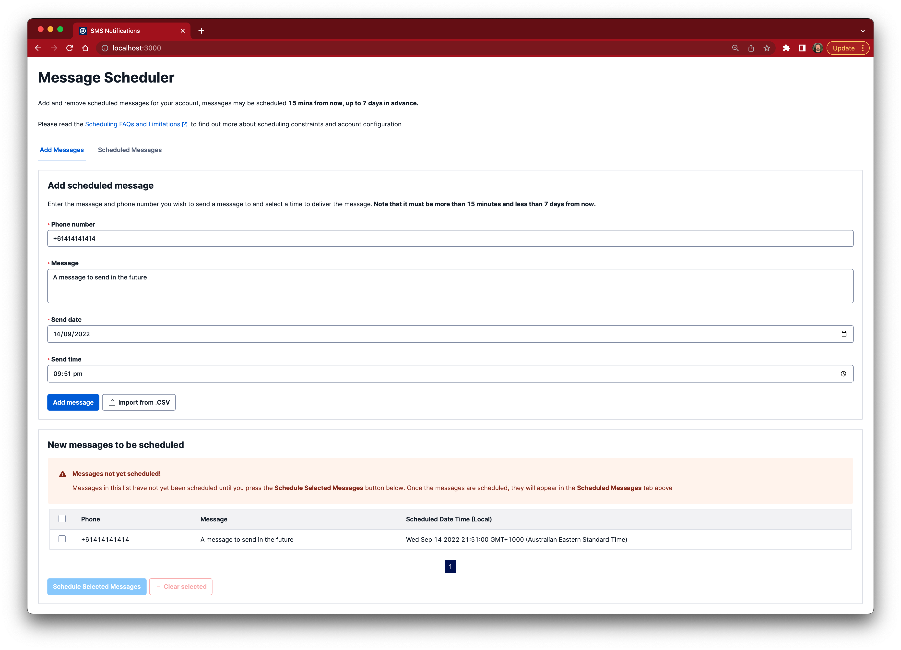

# SMS Notifications

Send SMS messages from the browser

Messages are sent via the Twilio SMS api using the scheduled messages feature.




## Pre-requisites

### Environment variables

This project requires some environment variables to be set. To keep your tokens and secrets secure, make sure to not commit the `.env` file in git. When setting up the project with `twilio serverless:init ...` the Twilio CLI will create a `.gitignore` file that excludes `.env` from the version history.

In your `.env` file, set the following values:

| Variable              | Description                                              | Required |
| :-------------------- | :------------------------------------------------------- | :------- |
| `TWILIO_PHONE_NUMBER` | The Twilio phone number to broadcast your messages from. | Yes      |
| `PASSCODE`            | A passcode to avoid anyone sending text messages         | Yes      |

Additional Testing environment variables are required for Testing and use of [Magic Number](https://www.twilio.com/blog/2018/04/twilio-test-credentials-magic-numbers.html)

| Variable           | Description                                                                             | Required        |
| :----------------- | :-------------------------------------------------------------------------------------- | :-------------- |
| `TESTMODE`         | Is this application running in Test Mode                                                | Yes             |
| `TEST_ACCOUNT_SID` | Test Credential SID from [here](https://www.twilio.com/console/project/settings)        | Yes in Testmode |
| `TEST_AUTH_TOKEN`  | Test Credential Auth Token from [here](https://www.twilio.com/console/project/settings) | Yes in Testmode |

### Function Parameters

#### List

`/api/list` gets invoked by the app and expects one parameter

| Parameter  | Description                                         | Required |
| :--------- | :-------------------------------------------------- | :------- |
| `passcode` | The passcode to compare against the stored passcode | Yes      |

Returns a list of scheduled messages for this account

#### Schedule

`/api/schedule` gets invoked by the app and expects three post parameters:

| Parameter    | Description                                              | Required |
| :----------- | :------------------------------------------------------- | :------- |
| `passcode`   | The passcode to compare against the stored passcode      | Yes      |
| `recipients` | An array of recipients (objects) with keys defined below | Yes      |

| Parameter | Description                                                    | Required |
| :-------- | :------------------------------------------------------------- | :------- |
| `cid`     | Correlation ID, returned in the response                       | Yes      |
| `phone`   | Destination phone number                                       | Yes      |
| `message` | Body of the message to send                                    | Yes      |
| `sendAt`  | ISO8601 Date/Time string representing when to send the message | Yes      |

Returns a list of messages indicating if they have been scheduled or failed to schedule (with error reason)

#### Cancel

`/api/cancel` gets invoked by the app and expects two post parameter

| Parameter  | Description                                                         | Required |
| :--------- | :------------------------------------------------------------------ | :------- |
| `passcode` | The passcode to compare against the stored passcode                 | Yes      |
| `sids`     | An array of message SIDs (strings) for each message to be cancelled | Yes      |

Returns a list of messages indicating if they have been canceled or failed to cancel (with error reason)

## Create a new project with the template

1. Install the [Twilio CLI](https://www.twilio.com/docs/twilio-cli/quickstart#install-twilio-cli)
2. Install the [serverless toolkit](https://www.twilio.com/docs/labs/serverless-toolkit/getting-started)

```shell
twilio plugins:install @twilio-labs/plugin-serverless
```

3. Start the server with the [Twilio CLI](https://www.twilio.com/docs/twilio-cli/quickstart):

```
twilio serverless:start
```

5. Open the web page at https://localhost:3000/index.html and enter your phone number, passcode and a message to test your app.

ℹ️ Check the developer console and terminal for any errors, make sure you've set your environment variables.

## Deploying

Deploy your functions and assets with either of the following commands. Note: you must run these commands from inside your project folder. [More details in the docs.](https://www.twilio.com/docs/labs/serverless-toolkit)

With the [Twilio CLI](https://www.twilio.com/docs/twilio-cli/quickstart):

```
twilio serverless:deploy
```

## License

This project is licensed under the MIT License - see the [LICENSE.md](license.md) file for details
